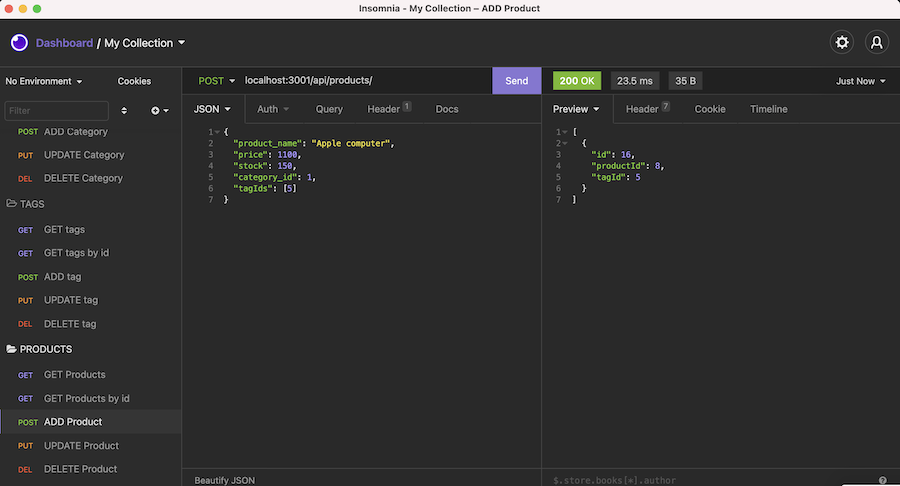
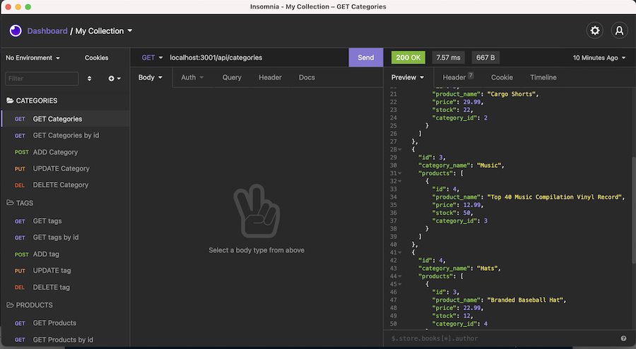
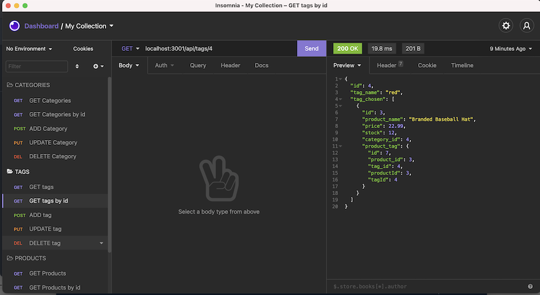

# Ecommerce-server

## Overview

In this project I configured a working Express.js API for the backend of an ecommerce site, incorporating Sequelize and a MySQL2 database.
Routes were tested in [Insomnia](https://insomnia.rest/) and the same can be done with [Postman](https://www.postman.com/).

## User Story

```md
AS A manager at an internet retail company
I WANT a back end for my e-commerce website that uses the latest technologies
SO THAT my company can compete with other e-commerce companies
```

## Instructions

Download or clone this repo, navigate to where you have stored the folder and follow these steps:

1. Create and save a .env file containing these 3 lines  
   `DB_USER=root`  
   `DB_PW=`  
   `DB_NAME='ecommerce_db'`
2. Run `npm init -y` to set up package.json, then install dependencies:
   `npm i mysql2 && npm i express && npm i sequelize && npm i dotenv`.
3. Connect to mysql 2 database: open schema.sql (db folder) in terminal, login with `mysql -u root -p` and set `source schema.sql` and copy-paste these 2 commands: `DROP DATABASE IF EXISTS ecommerce_db;` followed by `CREATE DATABASE ecommerce_db;`
4. Run `node seeds/index.js` to seed the data properly, then `node server.js` to create connection.
5. If connected on `localhost:3001`, you can now test the routes using GET-POST-PUT-DELETE commands with Insomnia or Postman.

I have demonstrated the full process from start to finish in the walkthrough video.

## Walkthrough Video

[View demonstration](https://www.youtube.com/watch?v=Hq_JFvxCw74)

## Screenshots

CREATE product example:  


GET categories:


GET tags by id example:

